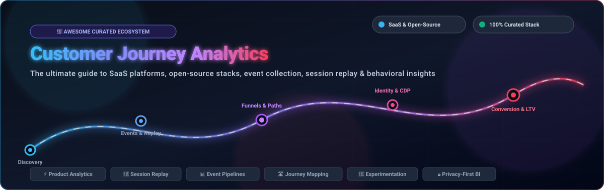

# 🗺️ Awesome Customer Journey Analytics

<p align="center">
  
</p>

<p align="center">
  <a href="https://github.com/ishandutta2007/Awesome-Awesome-Awesome"></a>
  <a href="https://discord.gg/jc4xtF58Ve"></a>
  <a href="https://github.com/ishandutta2007/Awesome-Customer-Journey-Analytics/stargazers"></a>
  <a href="https://github.com/ishandutta2007/Awesome-Customer-Journey-Analytics/network/members"></a>
  <a href="https://github.com/ishandutta2007/Awesome-Customer-Journey-Analytics/blob/main/LICENSE"></a>
  <a href="https://github.com/ishandutta2007/Awesome-Customer-Journey-Analytics/pulls"></a>
  <a href="https://github.com/ishandutta2007"></a>
</p>

---

### 🚀 Top Customer Journey Analytics (CJA) Tools & Modern Data Stack Ecosystem

> **Curated directory of SaaS/Hosted Platforms & Open-Source GitHub Projects**  
> *Covering Customer Journey Analytics, Product Analytics, Digital Experience Analytics (DXA), Session Replay, Behavioral Analytics, Event Streaming, Funnels, Cohorts, and Customer Data Platforms (CDPs).*  
> 📅 **Last updated: August 2026**

---

## 📖 Overview

**Customer Journey Analytics (CJA)** tracks, visualizes, and optimizes how users navigate across websites, mobile apps, SaaS products, marketing campaigns, customer support channels, and offline touchpoints. By connecting event streams with user identity and session recordings, modern journey analytics identifies friction points, drop-offs, onboarding bottlenecks, conversion drivers, and long-term retention patterns.

```
Touchpoint Event ──► Real-Time Stream ──► Identity Resolution ──► Journey Mapping & Replay ──► Action & Optimization
(Web/Mobile/API)      (Kafka/Flink)        (CDP / Warehouse)       (Funnels/Paths/Heatmaps)      (A/B Tests/Guides)
```

### 🎯 Key Domain Overlaps
Customer Journey Analytics intersects with:
* 📊 **Product Analytics** & **Behavioral Analytics** (Funnels, user flows, cohorts, retention curves)
* 🎥 **Digital Experience Analytics (DXA)** & **Session Replay** (Heatmaps, rage clicks, DOM replay)
* 🛣️ **Path & Funnel Analysis** (Multi-touch attribution, drop-off diagnostics, sankey diagrams)
* 🔄 **Customer Data Platforms (CDPs)** & **Event Pipelines** (Identity resolution, event ingestion, reverse ETL)
* 🧪 **Experimentation & Feature Management** (A/B testing, multivariate testing, feature flags)
* 🔒 **Privacy-First & Self-Hosted Analytics** (GDPR/CCPA compliant, cookieless tracking)

---

## 📑 Table of Contents

* [🏢 SaaS / Hosted Platforms](#-saashosted-platforms)
* [💻 Open-Source GitHub Projects](#-open-source-github-projects)
* [🔬 Additional Open-Source & Research Ecosystems](#-additional-open-source--research-ecosystems)
  * [⚡ Product & Behavioral Analytics](#-product--behavioral-analytics)
  * [🎥 Session Replay & Experience Diagnostics](#-session-replay--experience-diagnostics)
  * [📊 Event Collection & Customer Data Infrastructure](#-event-collection--customer-data-infrastructure)
  * [⚡ Customer Journey Data Processing & OLAP Engines](#-customer-journey-data-processing--olap-engines)
  * [📈 Visualization, Business Intelligence & Semantic Layer](#-visualization-business-intelligence--semantic-layer)
  * [🧪 Experimentation & Feature Management](#-experimentation--feature-management)
  * [🔄 Identity, Transformation & Orchestration](#-identity-transformation--orchestration)
  * [📡 Observability & Telemetry](#-observability--telemetry)
* [🏗️ Building a Custom Open-Source Customer Journey Analytics Stack](#-building-a-custom-open-source-customer-journey-analytics-stack)
* [💡 Important Customer Journey Analytics Concepts](#-important-customer-journey-analytics-concepts)
* [⭐ Star History](#-star-history)
* [🤝 How to Contribute](#-how-to-contribute)
* [⚠️ Disclaimer](#-disclaimer)

---

## 🏢 SaaS / Hosted Platforms

*Ranked in descending order by company scale (market capitalization, valuation, or estimated annual revenue).*

| 🏷️ Platform | 📝 Primary Focus & Description | 💰 Company Scale (Valuation / Revenue) | 💵 Starting Pricing | 🎁 Free Tier / Free Trial Limits |
| :--- | :--- | :--- | :--- | :--- |
| **[Microsoft Clarity](https://clarity.microsoft.com/)** | Free behavioral analytics & session recording platform with heatmaps, session replay, frustration signals (rage/dead clicks), and AI insights. | **~$3.1 Trillion** (Market Cap, Microsoft) | $0 (100% free forever, no paid tiers) | Free forever with unlimited sessions/traffic, unlimited websites, unlimited team seats, and 90-day recording retention |
| **[Google Analytics](https://marketingplatform.google.com/about/analytics/)** | Universal web and mobile app analytics platform providing acquisition, behavioral analysis, conversion tracking, and BigQuery export. | **~$2.1 Trillion** (Market Cap, Alphabet) | Free ($0/month standard GA4 version) | Free forever with standard limits (up to 14 months user data retention, standard reporting quotas, live demo account available) |
| **[Google Analytics 360](https://marketingplatform.google.com/about/analytics-360/)** | Enterprise edition of Google Analytics providing higher event limits, unsampled reporting, BigQuery export, SLAs, and enterprise support. | **~$2.1 Trillion** (Market Cap, Alphabet) | Starts at ~$50,000/year (covers up to 25 million monthly events) | No free tier; demo and sandbox environments available via Google Marketing Platform Sales Partners |
| **[Smartlook](https://www.smartlook.com/)** | Digital experience and session replay platform for web and mobile apps with funnels, heatmaps, event tracking, and anomaly detection. | **~$230 Billion** (Market Cap, Cisco; acquired) | Free plan is $0/month; paid Pro plans start at $55/month | Free forever plan includes up to 3,000 monthly sessions and 1-month data retention; 30-day free trial of paid plans |
| **[Adobe Customer Journey Analytics](https://business.adobe.com/products/analytics/customer-journey-analytics.html)** | Enterprise omnichannel customer journey analytics built on Adobe Experience Platform (AEP) for cross-channel customer profile analysis. | **~$210 Billion** (Market Cap, Adobe) | Enterprise contracts start at ~$50,000–$100,000+/year (priced by data volume and AEP compute) | No free tier or self-serve trial; enterprise proof-of-concept and guided demos available via sales |
| **[Segment](https://segment.com/)** | Customer data platform (CDP) for collecting, cleaning, and routing behavioral event streams to analytics and warehouse destinations. | **~$12 Billion** (Market Cap, Twilio; acquired for $3.2B) | Free plan is $0/month; paid Team plan starts at $120/month (includes 10,000 MTUs) | Free forever plan includes up to 1,000 Monthly Tracked Users (MTUs), 2 sources, 700+ integrations, and 1 warehouse destination; 14-day free trial for Team plan |
| **[Decibel](https://www.decibel.com/)** | Digital experience analytics technology scoring digital experiences (DXS), detecting friction, and providing session replays and heatmaps. | **~$6.4 Billion** (Valuation, Medallia; acquired for ~$160M) | Enterprise contracts start at ~$20,000/year (priced by Experience Data Records / EDR) | No free tier; personalized live product demo available upon request |
| **[Contentsquare](https://contentsquare.com/)** | Digital experience analytics platform providing journey analysis, session replay, heatmaps, funnels, mobile analytics, and monitoring. | **~$5.6 Billion** (Valuation, $1.4B+ raised) | Paid Growth plan starts at $39/month (billed annually) | Free forever plan includes up to 200,000 monthly sessions, session replays, heatmaps, funnels, and basic surveys (plus 15-day free trial of Growth plan) |
| **[Pendo](https://www.pendo.io/)** | Product experience platform combining product analytics, user behavior analysis, in-app guides, onboarding, and NPS feedback. | **~$2.6 Billion** (Valuation, ~$300M ARR) | Pendo Free is $0/month; paid Base plans start at ~$7,000/year (~$583/month) | Free forever plan includes up to 500 Monthly Active Users (MAUs), core analytics, and in-app guides; 30-day free trial available for full platform features |
| **[FullStory](https://www.fullstory.com/)** | Digital experience intelligence platform combining session replay, product analytics, journey mapping, and behavioral diagnostics. | **~$1.8 Billion** (Valuation, ~$95M+ ARR) | FullstoryFree is $0/month; paid Business plans start at ~$299–$899/month (custom quote) | Free forever plan (FullstoryFree) includes up to 30,000 sessions/month, 10 user seats, 12 months data retention, and core session replay/analytics; 14-day free trial of paid plans |
| **[Amplitude](https://amplitude.com/)** | Product and digital analytics platform providing behavioral analytics, funnels, journey paths, retention, cohorts, session replay, and experiments. | **~$1.7 Billion** (Market Cap, NASDAQ: AMPL; ~$410M ARR) | Starter plan is $0/month; Plus plan starts at $0/month (scales by event volume past 2M events/mo) | Free forever plan includes up to 2,000,000 events/month, unlimited seats, session replay, core analytics, AI agents, and unlimited feature flags |
| **[Mixpanel](https://mixpanel.com/)** | Event-based product analytics platform for user flows, funnel analysis, cohort segmentation, retention, and product experimentation. | **~$1.05 Billion** (Valuation, ~$100M+ ARR) | Free plan is $0/month; paid Growth plan starts at $0/month (first 1M events free, then scales with usage) | Free forever plan includes up to 1,000,000 events/month, 10,000 session replays/month, core analytics (insights, funnels, retention, flows), and 5 saved reports per seat |
| **[Quantum Metric](https://www.quantummetric.com/)** | Enterprise digital analytics platform combining behavioral, product, and journey analytics with friction detection and session replay. | **~$1.0 Billion** (Valuation, $250M+ raised) | Enterprise contracts start at ~$40,000/year (Salesforce AppExchange add-on starts at $75,000/org/year) | No free tier; customized live product demos available upon request |
| **[mParticle](https://www.mparticle.com/)** | Enterprise Customer Data Platform (CDP) providing data infrastructure, identity resolution, audience segmentation, and journey activation. | **~$500 Million** (Valuation, $270M+ raised) | Enterprise contracts start at ~$2,000–$5,000/month (~$25,000–$60,000/year based on mParticle Credits) | No permanent free tier; guided product demo and proof-of-concept trial available upon request |
| **[Heap](https://www.heap.io/)** | Digital insights and behavioral analytics platform featuring automatic event capture, journey mapping, funnels, and friction detection. | **~$500 Million** (Valuation; acquired by Contentsquare) | Free plan is $0/month; paid Growth plans start at ~$3,600/year (~$300/month) | Free forever plan includes up to 10,000 monthly sessions, charts, funnels, journey reports, and 6 months data history; 14-day free trial of paid tiers (no credit card required) |
| **[Hotjar](https://www.hotjar.com/)** | Product and experience analytics tool providing heatmaps, session recordings, conversion funnels, feedback widgets, and user interviews. | **~$400 Million** (Valuation; acquired by Contentsquare) | Free Basic is $0/month; paid Observe plans start at $39/month (billed annually) | Free forever Basic plan includes up to 35 daily sessions (1,050 sessions/month) and unlimited heatmaps; 15-day free trial of paid Business plans |
| **[Snowplow](https://snowplow.io/)** | Behavioral data platform generating granular event streams for customer journey, product analytics, and AI modeling. | **~$200 Million** (Valuation, $50M+ raised, ~$20M+ ARR) | Snowplow BDP Cloud starts at ~$1,500/month (managed pipeline); open-source edition is $0 | 14-day free trial of Snowplow BDP Cloud (full pipeline functionality, no credit card required); open-source pipeline is free forever self-hosted |
| **[Glassbox](https://www.glassbox.com/)** | Digital experience intelligence platform capturing web and mobile customer journeys, session replay, friction detection, and behavioral insights. | **~$100M–$150 Million** (Valuation; acquired by Alicia Tech) | Enterprise contracts start at ~$10,000–$50,000/year | No free tier; personalized product consultations and interactive demos available upon request |
| **[Indicative](https://www.indicative.com/)** | Customer journey analytics platform for multi-path journey mapping, funnel analysis, cohort tracking, and segmentation. | **~$40 Million** (Valuation; acquired by mParticle) | Free plan is $0/month; paid Standard plans start at $249/month | Free forever plan includes up to 25,000,000 events/month, 3 users, 3 integrations, and 6 months data history; 14-day free trial of paid features |
| **[Mouseflow](https://mouseflow.com/)** | Behavior analytics platform offering session replay, dynamic heatmaps, conversion funnels, form analytics, user feedback, and friction detection. | **~$15M–$25 Million** (Estimated Annual Revenue) | Free plan is $0/month; paid Essential plan starts at €25/month (~$27/month, billed annually) | Free forever plan includes up to 500 recordings/month for 1 website and 1 month storage; 14-day free trial of paid plans (no credit card required) |
| **[Crazy Egg](https://www.crazyegg.com/)** | Website optimization and behavior analysis tool featuring heatmaps, scroll maps, session recordings, A/B testing, and traffic analysis. | **~$15M–$20 Million** (Estimated Annual Revenue) | Paid plans start at $29/month (billed annually); Instant Heatmaps feature is $0/month | 30-day free trial for all paid subscription plans; Instant Heatmaps tool is free forever with no credit card required |
| **[Lucky Orange](https://www.luckyorange.com/)** | Conversion rate and behavioral analytics suite featuring session recordings, heatmaps, conversion funnels, form analytics, and live chat. | **~$10M–$15 Million** (Estimated Annual Revenue) | Free plan is $0/month; paid Build plan starts at $32/month (billed annually) | Free forever plan includes up to 100 sessions/month for 1 site (30-day storage); 7-day free trial with full access to all features |
| **[Woopra](https://www.woopra.com/)** | Customer journey analytics platform offering real-time user profiles, journey visualization, retention analysis, and automated triggers. | **~$5M–$10 Million** (Estimated Annual Revenue) | Core plan is $0/month; paid Pro plan starts at $999/month | Free forever Core plan includes up to 500,000 actions/month, 90-day data retention, and 30+ integrations; 14-day free trial of Pro plan |
| **[Kissmetrics](https://www.kissmetrics.io/)** | Person-based product and customer journey analytics platform focused on cohort analysis, funnels, user retention, and revenue attribution. | **~$5M–$10 Million** (Estimated Annual Revenue) | Free workspace is $0/month; paid plans start at $99/month | Free forever workspace includes up to 100,000 events/month, 3 seats, tracking, attribution, and 1 dashboard (no credit card required) |
| **[Matomo](https://matomo.org/)** | Privacy-centric web and digital analytics platform offering heatmaps, session recordings, funnels, goals, and custom reports. | **~$5M–$10 Million** (Annual Revenue, InnoCraft) | Matomo Cloud starts at $23/month (up to 50,000 monthly hits); Matomo On-Premise is $0 (open source) | 21-day free trial for Matomo Cloud (no credit card required); self-hosted On-Premise version is free forever with no data limits |
| **[Countly](https://countly.com/)** | Product analytics and user engagement platform tracking customer journeys across web, mobile, desktop, and IoT devices. | **~$3M–$8 Million** (Estimated Annual Revenue) | Countly Flex Cloud starts at $175/month; self-hosted Lite edition is $0 (open source) | 14-day free trial for Countly Flex Cloud; self-hosted Countly Lite is free forever (community edition) |
| **[Plausible Analytics](https://plausible.io/)** | Lightweight, open-source, privacy-first web analytics platform providing essential traffic and goal conversion metrics without personal data tracking. | **~$2M–$4 Million** (Annual Recurring Revenue, Bootstrapped) | Hosted cloud starts at $9/month (up to 10,000 monthly pageviews); self-hosted is $0 (open source) | 30-day free trial with full features (no credit card required); self-hosted Community Edition is free forever |

---

## 💻 Open-Source GitHub Projects

*Sorted in descending order by GitHub stargazers count.*

* **[ClickHouse](https://github.com/ClickHouse/ClickHouse)** [](https://github.com/ClickHouse/ClickHouse/stargazers)  
  High-performance, column-oriented SQL database management system for real-time analytical reporting, event processing, and customer journey analytics.

* **[Umami](https://github.com/umami-software/umami)** [](https://github.com/umami-software/umami/stargazers)  
  Simple, fast, privacy-focused open-source alternative to Google Analytics with custom events, funnel tracking, sessions, campaigns, and user behavior analysis.

* **[PostHog](https://github.com/PostHog/posthog)** [](https://github.com/PostHog/posthog/stargazers)  
  Comprehensive open-source product analytics suite providing event capture, funnels, user paths, retention, cohorts, session replay, feature flags, A/B testing, and data warehouse integration.

* **[Signoz](https://github.com/signoz/signoz)** [](https://github.com/signoz/signoz/stargazers)  
  Open-source observability and APM platform built on ClickHouse and OpenTelemetry, enabling end-to-end tracing of user journeys and backend service interactions.

* **[Plausible Analytics](https://github.com/plausible/analytics)** [](https://github.com/plausible/analytics/stargazers)  
  Lightweight, open-source, privacy-friendly web analytics platform without cookies, providing clean traffic dashboards, custom events, and goal conversion tracking.

* **[Airbyte](https://github.com/airbytehq/airbyte)** [](https://github.com/airbytehq/airbyte/stargazers)  
  Open-source data integration engine to replicate customer journey data from SaaS tools, databases, and APIs into analytics data warehouses.

* **[Matomo](https://github.com/matomo-org/matomo)** [](https://github.com/matomo-org/matomo/stargazers)  
  Full-featured open-source web and digital analytics platform providing user flows, goals, funnels, heatmaps, session recordings, and complete data ownership.

* **[GoAccess](https://github.com/allinurl/goaccess)** [](https://github.com/allinurl/goaccess/stargazers)  
  Real-time web log analyzer and interactive viewer running in terminal or browser for low-overhead traffic and journey diagnostics.

* **[Cube](https://github.com/cube-js/cube)** [](https://github.com/cube-js/cube/stargazers)  
  Universal semantic layer for building customer journey analytics, BI dashboards, and event modeling on top of data warehouses.

* **[rrweb](https://github.com/rrweb-io/rrweb)** [](https://github.com/rrweb-io/rrweb/stargazers)  
  Open-source web session-recording library for recording, serializing, and replaying DOM interactions to analyze customer behavior.

* **[OpenReplay](https://github.com/openreplay/openreplay)** [?style=social&color=white](https://github.com/openreplay/openreplay/stargazers)  
  Open-source, self-hosted session replay and product analytics suite capturing DOM changes, network requests, console logs, Redux state, and UX friction.

* **[HyperDX](https://github.com/hyperdxio/hyperdx)** [](https://github.com/hyperdxio/hyperdx/stargazers)  
  Open-source developer observability platform unifying session replays, traces, logs, and user journey diagnostics.

* **[Highlight.io](https://github.com/highlight/highlight)** [](https://github.com/highlight/highlight/stargazers)  
  Open-source, full-stack monitoring platform with session replay, error monitoring, logging, and user journey visualization.

* **[GrowthBook](https://github.com/growthbook/growthbook)** [](https://github.com/growthbook/growthbook/stargazers)  
  Open-source feature flagging and A/B testing platform with Bayesian/Frequentist statistical engines connected directly to your data warehouse.

* **[Fathom Lite](https://github.com/usefathom/fathom)** [](https://github.com/usefathom/fathom/stargazers)  
  Open-source, privacy-focused website analytics built with Go and Preact for simple, GDPR-compliant traffic tracking.

* **[Snowplow](https://github.com/snowplow/snowplow)** [](https://github.com/snowplow/snowplow/stargazers)  
  Industrial-grade behavioral data pipeline for capturing, enriching, and modeling granular first-party event streams across web, mobile, and server touchpoints.

* **[GoatCounter](https://github.com/arp242/goatcounter)** [](https://github.com/arp242/goatcounter/stargazers)  
  Open-source web analytics software that can be used as a hosted service or self-hosted, emphasizing privacy and lightweight integration.

* **[Countly](https://github.com/countly/countly-server)** [](https://github.com/countly/countly-server/stargazers)  
  Product analytics and user engagement platform tracking customer journeys across web, mobile, desktop, and IoT devices.

* **[Jitsu](https://github.com/jitsucom/jitsu)** [](https://github.com/jitsucom/jitsu/stargazers)  
  Open-source event ingestion engine and CDP alternative for capturing, transforming, and routing user events to ClickHouse, Postgres, and BigQuery.

* **[Ackee](https://github.com/electerious/Ackee)** [](https://github.com/electerious/Ackee/stargazers)  
  Self-hosted, Node.js-based website analytics platform with cookie-less tracking and privacy-focused visitor analytics.

* **[RudderStack](https://github.com/rudderlabs/rudder-server)** [](https://github.com/rudderlabs/rudder-server/stargazers)  
  Open-source customer data infrastructure (CDI) and event pipeline for collecting, storing, and routing behavioral data to 180+ destinations.

* **[Open Web Analytics](https://github.com/Open-Web-Analytics/Open-Web-Analytics)** [](https://github.com/Open-Web-Analytics/Open-Web-Analytics/stargazers)  
  Open-source web analytics framework providing page views, event tracking, visitor tracking, heatmaps, and funnel diagnostics.

* **[Shynet](https://github.com/milesmcc/shynet)** [](https://github.com/milesmcc/shynet/stargazers)  
  Modern, privacy-friendly, cookieless web analytics server designed for self-hosting without client-side JavaScript cookies.

* **[Rill](https://github.com/rilldata/rill)** [](https://github.com/rilldata/rill/stargazers)  
  Fast, embedded business intelligence layer for DuckDB and ClickHouse, ideal for real-time exploratory customer journey dashboards.

* **[Aptabase](https://github.com/aptabase/aptabase)** [](https://github.com/aptabase/aptabase/stargazers)  
  Open-source, privacy-first analytics platform tailored for mobile, desktop, and web applications.

* **[Litlyx](https://github.com/litlyx/litlyx)** [](https://github.com/litlyx/litlyx/stargazers)  
  Open-source, AI-powered analytics platform for web and app developers with single-line setup and real-time event aggregation.

* **[Swetrix](https://github.com/swetrix/swetrix)** [](https://github.com/swetrix/swetrix/stargazers)  
  Lightweight, open-source, cookie-less web analytics platform offering custom alerts, live visitor tracking, and performance metrics.

* **[Pirsch Analytics](https://github.com/pirsch-analytics/pirsch)** [](https://github.com/pirsch-analytics/pirsch/stargazers)  
  Cookie-free open-source web analytics platform with server-side SDKs, events, funnels, and conversion tracking.

* **[PostHog JS Library](https://github.com/PostHog/posthog-js)** [](https://github.com/PostHog/posthog-js/stargazers)  
  Open-source JavaScript SDK for capturing client-side interactions, rage clicks, and session recordings for PostHog.

* **[Snowplow JavaScript Tracker](https://github.com/snowplow/snowplow-javascript-tracker)** [](https://github.com/snowplow/snowplow-javascript-tracker/stargazers)  
  Client-side event tracking library for capturing granular browser interactions and customer journey events.

* **[Segment Analytics.js 2.0](https://github.com/segmentio/analytics-next)** [](https://github.com/segmentio/analytics-next/stargazers)  
  Open-source client-side analytics collection SDK providing the `analytics.js` interface for behavioral event tracking.

* **[Ackee Tracker](https://github.com/electerious/ackee-tracker)** [](https://github.com/electerious/ackee-tracker/stargazers)  
  Lightweight tracking script for sending visitor analytics data to self-hosted Ackee instances.

* **[Snowplow Android Tracker](https://github.com/snowplow/snowplow-android-tracker)** [](https://github.com/snowplow/snowplow-android-tracker/stargazers)  
  Android event-tracking library for collecting mobile behavioral data and in-app journey events.

* **[Snowplow iOS Tracker](https://github.com/snowplow/snowplow-ios-tracker)** [](https://github.com/snowplow/snowplow-ios-tracker/stargazers)  
  iOS event-tracking library for capturing iOS/macOS mobile customer interactions.

* **[PostHog Python](https://github.com/PostHog/posthog-python)** [](https://github.com/PostHog/posthog-python/stargazers)  
  Open-source Python SDK for capturing backend events and associating them with customer profiles and product journeys.

---

## 🔬 Additional Open-Source & Research Ecosystems

*Sorted within each category by GitHub stargazers count descending.*

### ⚡ Product & Behavioral Analytics
* **[Umami](https://github.com/umami-software/umami)** [](https://github.com/umami-software/umami/stargazers) — Privacy-focused web analytics with events, funnels, and custom parameters.
* **[PostHog](https://github.com/PostHog/posthog)** [](https://github.com/PostHog/posthog/stargazers) — Full product analytics, funnels, user paths, retention, cohorts, and experiments.
* **[Plausible](https://github.com/plausible/analytics)** [](https://github.com/plausible/analytics/stargazers) — Lightweight, privacy-first web analytics with goals and custom events.
* **[Matomo](https://github.com/matomo-org/matomo)** [](https://github.com/matomo-org/matomo/stargazers) — Web & behavioral analytics, conversion funnels, and visitor profiles.
* **[Countly](https://github.com/countly/countly-server)** [](https://github.com/countly/countly-server/stargazers) — Product analytics and user engagement across web, mobile, and IoT.
* **[Ackee](https://github.com/electerious/Ackee)** [](https://github.com/electerious/Ackee/stargazers) — Self-hosted website analytics with event tracking.
* **[Aptabase](https://github.com/aptabase/aptabase)** [](https://github.com/aptabase/aptabase/stargazers) — Privacy-first analytics for mobile and desktop applications.
* **[Litlyx](https://github.com/litlyx/litlyx)** [](https://github.com/litlyx/litlyx/stargazers) — Open-source developer-friendly analytics with AI data querying.
* **[Swetrix](https://github.com/swetrix/swetrix)** [](https://github.com/swetrix/swetrix/stargazers) — Cookie-free web analytics platform with customizable live alerts.
* **[Pirsch](https://github.com/pirsch-analytics/pirsch)** [](https://github.com/pirsch-analytics/pirsch/stargazers) — Privacy-friendly analytics with events, funnels, and server-side tracking.

### 🎥 Session Replay & Experience Diagnostics
* **[PostHog](https://github.com/PostHog/posthog)** [](https://github.com/PostHog/posthog/stargazers) — Session recordings integrated directly with funnels, user paths, and feature flags.
* **[rrweb](https://github.com/rrweb-io/rrweb)** [](https://github.com/rrweb-io/rrweb/stargazers) — Open-source web session-recording library for capturing and replaying DOM mutations.
* **[OpenReplay](https://github.com/openreplay/openreplay)** [](https://github.com/openreplay/openreplay/stargazers) — Self-hosted session replay with network logs, console messages, and state inspection.
* **[HyperDX](https://github.com/hyperdxio/hyperdx)** [](https://github.com/hyperdxio/hyperdx/stargazers) — Developer observability connecting session replays with distributed traces and backend logs.
* **[Highlight.io](https://github.com/highlight/highlight)** [](https://github.com/highlight/highlight/stargazers) — Full-stack session replay, error monitoring, and journey friction analysis.

### 📊 Event Collection & Customer Data Infrastructure
* **[Snowplow](https://github.com/snowplow/snowplow)** [](https://github.com/snowplow/snowplow/stargazers) — Granular event collection, schema validation, and behavioral data pipeline.
* **[Jitsu](https://github.com/jitsucom/jitsu)** [](https://github.com/jitsucom/jitsu/stargazers) — Open-source event collection engine and CDP routing data to warehouses in real time.
* **[RudderStack](https://github.com/rudderlabs/rudder-server)** [](https://github.com/rudderlabs/rudder-server/stargazers) — Open-source customer data infrastructure and event routing pipeline.
* **[OpenTelemetry Specification](https://github.com/open-telemetry/opentelemetry-specification)** [](https://github.com/open-telemetry/opentelemetry-specification/stargazers) — Open standard for telemetry data unifying traces, metrics, and user event signals.
* **[Segment Analytics.js](https://github.com/segmentio/analytics-next)** [](https://github.com/segmentio/analytics-next/stargazers) — Client-side SDK for collecting and routing event data across destinations.

### ⚡ Customer Journey Data Processing & OLAP Engines
* **[ClickHouse](https://github.com/ClickHouse/ClickHouse)** [](https://github.com/ClickHouse/ClickHouse/stargazers) — Ultra-fast columnar OLAP database tailored for high-volume customer event queries.
* **[Apache Spark](https://github.com/apache/spark)** [](https://github.com/apache/spark/stargazers) — Unified analytics engine for large-scale behavioral data processing and path computation.
* **[DuckDB](https://github.com/duckdb/duckdb)** [](https://github.com/duckdb/duckdb/stargazers) — Fast in-process SQL OLAP engine for local journey exploration and fast aggregation.
* **[Apache Kafka](https://github.com/apache/kafka)** [](https://github.com/apache/kafka/stargazers) — Distributed event streaming platform for real-time customer interaction pipelines.
* **[Apache Flink](https://github.com/apache/flink)** [](https://github.com/apache/flink/stargazers) — Stateful stream processing framework for real-time funnel calculations and sessionization.
* **[Apache Druid](https://github.com/apache/druid)** [](https://github.com/apache/druid/stargazers) — High-performance real-time analytics database designed for fast OLAP slice-and-dice.
* **[Trino](https://github.com/trinodb/trino)** [](https://github.com/trinodb/trino/stargazers) — Distributed SQL query engine for federated queries across journey data lakes and warehouses.
* **[Apache Pinot](https://github.com/apache/pinot)** [](https://github.com/apache/pinot/stargazers) — Real-time distributed OLAP datastore built for ultra-low-latency user-facing journey analytics.

### 📈 Visualization, Business Intelligence & Semantic Layer
* **[Grafana](https://github.com/grafana/grafana)** [](https://github.com/grafana/grafana/stargazers) — Visualization and dashboarding platform supporting time-series and event analytics.
* **[Apache Superset](https://github.com/apache/superset)** [](https://github.com/apache/superset/stargazers) — Enterprise data visualization and business intelligence platform with rich funnel charts.
* **[Metabase](https://github.com/metabase/metabase)** [](https://github.com/metabase/metabase/stargazers) — User-friendly BI tool for non-technical teams to explore user retention, cohorts, and metrics.
* **[Redash](https://github.com/getredash/redash)** [](https://github.com/getredash/redash/stargazers) — Open-source SQL visualization platform for connecting multiple journey data sources.
* **[Cube](https://github.com/cube-js/cube)** [](https://github.com/cube-js/cube/stargazers) — Universal semantic layer providing consistent metrics definition for journey dashboards.
* **[Evidence](https://github.com/evidence-dev/evidence)** [](https://github.com/evidence-dev/evidence/stargazers) — Code-based BI platform creating markdown-powered analytical journey reports.
* **[Lightdash](https://github.com/lightdash/lightdash)** [](https://github.com/lightdash/lightdash/stargazers) — Open-source BI platform natively integrated with dbt for analytics engineering teams.
* **[Rill](https://github.com/rilldata/rill)** [](https://github.com/rilldata/rill/stargazers) — Fast, exploratory operational BI for event logs and ClickHouse/DuckDB datasets.

### 🧪 Experimentation & Feature Management
* **[Unleash](https://github.com/Unleash/unleash)** [](https://github.com/Unleash/unleash/stargazers) — Enterprise open-source feature management and gradual rollout platform.
* **[GrowthBook](https://github.com/growthbook/growthbook)** [](https://github.com/growthbook/growthbook/stargazers) — Warehouse-native A/B testing and experimentation platform with stats engines.
* **[Flagsmith](https://github.com/Flagsmith/flagsmith)** [](https://github.com/Flagsmith/flagsmith/stargazers) — Open-source feature flag and remote configuration service with user segment targeting.

### 🔄 Identity, Transformation & Orchestration
* **[Apache Airflow](https://github.com/apache/airflow)** [](https://github.com/apache/airflow/stargazers) — Programmatic workflow orchestration platform for scheduling journey data transformations.
* **[Airbyte](https://github.com/airbytehq/airbyte)** [](https://github.com/airbytehq/airbyte/stargazers) — Open-source ELT data integration pipeline for syncing customer touchpoints.
* **[Dagster](https://github.com/dagster-io/dagster)** [](https://github.com/dagster-io/dagster/stargazers) — Cloud-native data orchestrator designed for asset-centric journey pipelines.
* **[dbt Core](https://github.com/dbt-labs/dbt-core)** [](https://github.com/dbt-labs/dbt-core/stargazers) — Analytics engineering framework for transforming raw event tables into journey models.
* **[Meltano](https://github.com/meltano/meltano)** [](https://github.com/meltano/meltano/stargazers) — Open-source ELT engine built on Singer connectors for custom journey pipelines.

### 📡 Observability & Telemetry
* **[Signoz](https://github.com/signoz/signoz)** [](https://github.com/signoz/signoz/stargazers) — Open-source APM, traces, and metrics monitoring built on ClickHouse.
* **[HyperDX](https://github.com/hyperdxio/hyperdx)** [](https://github.com/hyperdxio/hyperdx/stargazers) — Unified session replay, traces, and logs for diagnosing customer friction.
* **[OpenTelemetry Specification](https://github.com/open-telemetry/opentelemetry-specification)** [](https://github.com/open-telemetry/opentelemetry-specification/stargazers) — Industry standard for telemetry instrumentation across applications.

---

## 🏗️ Building a Custom Open-Source Customer Journey Analytics Stack

A production-ready open-source customer journey analytics architecture connects event collection, streaming, warehousing, session replay, transformation, and BI visualization:

```text
                    ┌───────────────────────────────────────────┐
                    │          🌐 Customer Touchpoints          │
                    │   Web / Mobile / Product / Email / Ads    │
                    │      Support / IoT / Offline Stores       │
                    └─────────────────────┬─────────────────────┘
                                          │
                                          ▼
                    ┌───────────────────────────────────────────┐
                    │          📥 Event Ingestion & SDKs        │
                    │   Snowplow / RudderStack / Jitsu / SDKs   │
                    └─────────────────────┬─────────────────────┘
                                          │
                                          ▼
                    ┌───────────────────────────────────────────┐
                    │          ⚡ Real-Time Streaming           │
                    │        Apache Kafka / Apache Flink        │
                    └─────────────────────┬─────────────────────┘
                                          │
                                          ▼
                    ┌───────────────────────────────────────────┐
                    │          🗄️ Analytical Data Warehouse     │
                    │    ClickHouse / DuckDB / PostgreSQL       │
                    │      BigQuery / Snowflake / Redshift      │
                    └─────────────────────┬─────────────────────┘
                                          │
                                          ▼
                    ┌───────────────────────────────────────────┐
                    │      🔄 Identity Resolution & ELT         │
                    │       dbt / Airbyte / Apache Spark        │
                    │         Dagster / Apache Airflow          │
                    └─────────────────────┬─────────────────────┘
                                          │
                    ┌─────────────────────┴─────────────────────┐
                    │                                           │
                    ▼                                           ▼
       ┌───────────────────────────┐             ┌───────────────────────────┐
       │  📊 Behavioral Analytics  │             │     🎥 Session Replay     │
       │    PostHog / Umami /      │             │    OpenReplay / rrweb     │
       │     Matomo / Countly      │             │  Highlight.io / HyperDX   │
       └────────────┬──────────────┘             └─────────────┬─────────────┘
                    │                                          │
                    └─────────────────────┬────────────────────┘
                                          │
                                          ▼
                    ┌───────────────────────────────────────────┐
                    │          🛣️ Journey Intelligence          │
                    │   Funnels / Paths / Cohorts / Retention   │
                    │       Friction & Drop-Off Diagnostics     │
                    └─────────────────────┬─────────────────────┘
                                          │
                                          ▼
                    ┌───────────────────────────────────────────┐
                    │          📈 Visualization & BI            │
                    │    Apache Superset / Grafana / Metabase   │
                    │            Cube / Evidence / Rill         │
                    └─────────────────────┬─────────────────────┘
                                          │
                                          ▼
                    ┌───────────────────────────────────────────┐
                    │        🧪 Experimentation & Action        │
                    │      GrowthBook / Unleash / Flagsmith     │
                    │       Automated Triggers & Reverse ETL    │
                    └───────────────────────────────────────────┘
```

### 💡 Recommended Open-Source Stacks

* **🚀 Developer Product Analytics Stack**  
  `PostHog + ClickHouse + PostgreSQL`  
  *Best for SaaS and product engineering teams wanting event capture, funnels, user paths, session replays, feature flags, and A/B tests in one unified stack.*

* **🔒 Privacy-First Web Analytics Stack**  
  `Umami / Plausible + PostgreSQL + Metabase`  
  *Best for lightweight, GDPR-compliant website journey measurement without tracking cookies.*

* **🏢 Enterprise First-Party Data Pipeline**  
  `Snowplow / RudderStack + Kafka + ClickHouse + dbt + Apache Superset`  
  *Best for organizations needing complete ownership of raw behavioral event streams, custom identity resolution, and enterprise BI.*

* **🎥 Experience Diagnostics & Observability Stack**  
  `OpenReplay / Highlight.io + HyperDX + ClickHouse + Grafana`  
  *Combines video session replay with network traffic, browser console logs, backend traces, and error telemetry.*

* **🌐 Full Open-Source Customer Journey Architecture**  
  `Snowplow/Jitsu → Kafka → ClickHouse → dbt → PostHog/OpenReplay → Superset/Metabase → GrowthBook`  
  *Delivers the full functional capability of high-end commercial journey analytics platforms with complete data privacy and sovereignty.*

---

## 💡 Important Customer Journey Analytics Concepts

A comprehensive customer journey analytics framework encompasses the following key capabilities:

* 🎯 **Event Tracking** — Capturing user interactions (clicks, pageviews, purchases, form submits, API calls).
* 🤖 **Autocapture** — Automatically recording all client-side DOM events without manual tag instrumentation.
* ⏱️ **Session Tracking & Stitching** — Grouping individual interaction events into coherent user sessions.
* 🆔 **Identity Resolution** — Unifying anonymous browsing activity with authenticated user profiles across devices.
* 👤 **Customer 360 Profiles** — Building aggregated behavioral profiles with computed traits, metrics, and event history.
* 🗺️ **Journey Mapping & Flow Diagrams** — Visualizing multi-touch progression paths across digital and offline channels.
* 🛣️ **Path Analysis & Discovery** — Uncovering the most common routes, loops, and unexpected detours users take.
* 📉 **Funnel Analysis & Drop-Off Diagnostics** — Measuring conversion velocity and pinpointing exact step-by-step abandonment.
* 🔄 **Retention & Churn Analysis** — Tracking daily/weekly/monthly active return rates through cohort retention matrices.
* 👥 **Behavioral Cohort Segmentation** — Grouping users by actions performed (e.g., "Users who completed onboarding within 24 hours").
* 🎥 **Session Replay** — Pixel-perfect video-like reconstruction of user interactions to diagnose usability issues.
* 🌡️ **Heatmaps & Attention Maps** — Visualizing click distribution, scroll depth, and mouse movement density.
* 😡 **Rage Click & Dead Click Detection** — Automatically surfacing frustration signals indicating broken UI elements.
* ⚡ **Friction & Anomaly Detection** — Using heuristics or machine learning to flag abnormal drops in journey progression.
* 🎯 **Journey Orchestration & Activation** — Triggering automated emails, push notifications, or CRM updates based on journey milestones.
* 🌐 **Omnichannel & Offline Integration** — Blending in-store POS transactions, call center tickets, and marketing ad touches into one profile.
* 🧪 **Experimentation & Feature Flags** — Testing new user experiences and measuring their statistical impact on conversion funnels.
* 💰 **Multi-Touch Attribution (MTA)** — Evaluating which touchpoints contribute most effectively to pipeline and revenue.
* 📈 **Customer Lifetime Value (LTV) Prediction** — Forecasting long-term revenue potential from early behavioral journey patterns.
* 🔒 **Privacy & Consent Management** — Ensuring full compliance with GDPR, CCPA, and privacy frameworks with cookieless tracking options.

---

## ⭐ Star History

[](https://star-history.dera.page/#ishandutta2007/Awesome-Customer-Journey-Analytics&type=date&legend=top-left)

---

## 🤝 How to Contribute

1. 🍴 Fork the repository on GitHub.
2. 🌿 Create a new branch (`git checkout -b feature/add-tool-name`).
3. 📝 Add your entry in alphabetical or star-ranked order following the existing table or list format.
4. 🔗 Provide the official website link, GitHub repo link (with star badge), accurate starting price, and free tier/trial details.
5. ✍️ Keep descriptions factual, objective, and concise (1–2 sentences).
6. 🚀 Commit and push your changes (`git commit -m "feat: add [Tool Name]" && git push origin feature/add-tool-name`).
7. 📬 Open a Pull Request with a short summary of the addition.

---

## ⚠️ Disclaimer

* This repository is a **community-curated directory** intended for educational and architectural reference — not an official endorsement of any listed tool.
* Customer Journey Analytics overlaps with product analytics, digital experience analytics, session replay, CDPs, and business intelligence.
* Open-source, source-available, open-core, and SaaS pricing models are subject to change. Always verify the current licensing and terms on official vendor websites before adoption.
* Behavioral analytics involves collecting user interaction data. Organizations must ensure proper user consent, data masking, GDPR/CCPA compliance, and secure storage practices.

---

<p align="center">
  <b>Made with ❤️ for product managers, growth teams, UX researchers, data engineers, analysts, and developers.</b><br>
  <i>Empowering teams to build open, privacy-conscious, scalable, and customer-centric analytics architectures.</i>
</p>
